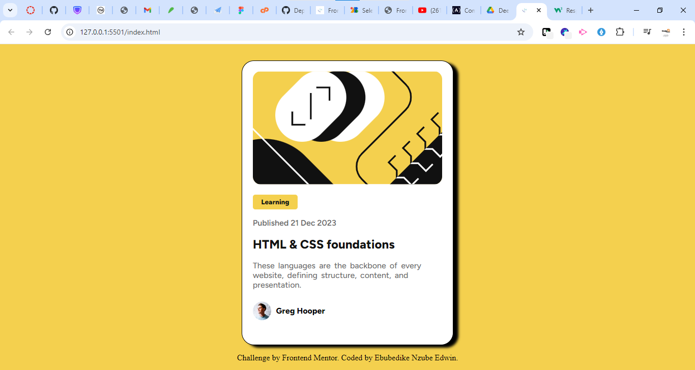
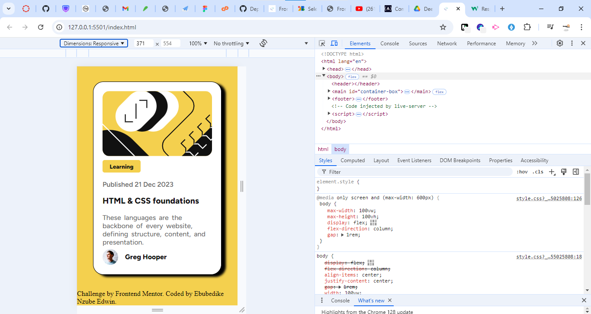

# Introduction

Re-creation of Frontend Mentor Challenge- Blog preview card under the supervision of WEB3BRIDGE

## Table of contents

- [Overview]
  - [The-challenge]
  - [Screenshot]
- [My-process]
  - [Built-with]
  - [What-I-learned]
  - [Continued-development]
- [Author]
- [Acknowledgments]


## OVERVIEW 

### The challenge
https://www.frontendmentor.io/challenges/blog-preview-card-ckPaj01IcS/hub

### Screenshot
here is the screenshot of my solution, 
1. my desktop view 
2. my mobile view 

## My Process

### Built with
- Semantic HTML5 markup
- CSS custom properties
- Flexbox
- Mobile-first workflow
- Used google font [figtree= font weight: 500 and 800] for my fonts

### What I learned
I learnt how to navigate around using flex and also an insight in my Media Query
```html
<h1>Some HTML code I'm proud of</h1>
```
```css
h1 {
  display: flex;
}

@media only screen and (max-width: 600px){
    body{
        max-width: 100vw;
        max-height: 100vh;
    }
}
```


### Continued development
- I wish to learn more on my media query, because it seems not to work in all mobile screen as wanted
- To grind more and deepen my knowledge in CSS 


## Author

- Name - [Ebubedike Nzube Edwin]
- Frontend Mentor - [@zubby126](https://www.frontendmentor.io/profile/Zubby126)
- Twitter - [@eddie_bullion](https://x.com/eddie_bullion?t=hKraQ43Xwien8NG-KkUqRQ&s=08)
- Github - [@zubby126] (https://github.com/Zubby126)


## Acknowledgments

I want to Acknowledge these fellows for thier help and support in achieveing this project

- Frontend Mentor 
- Web3bridge
- BlackAdams [https://github.com/Ultra-Tech-code]